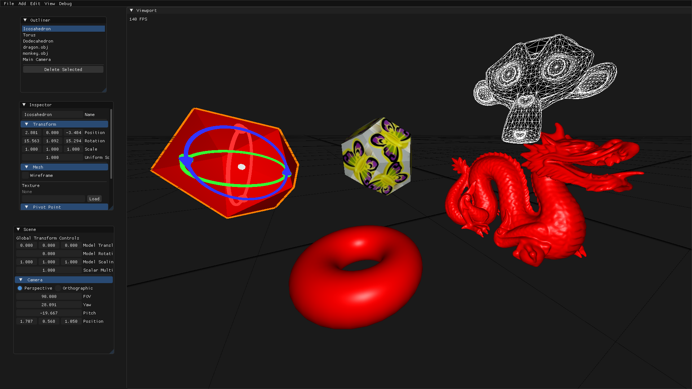
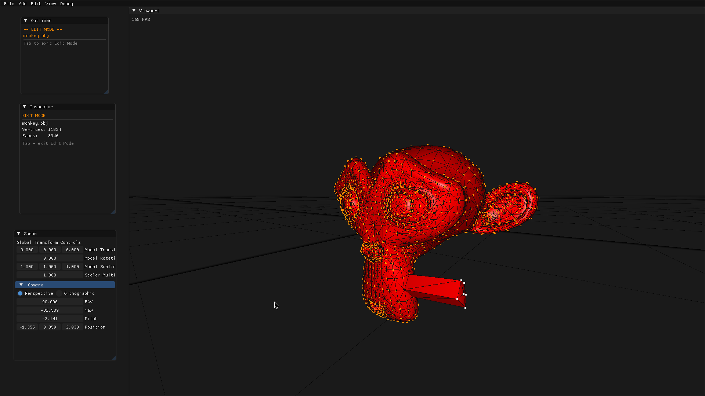

<h1 align="center">Sculpt</h1>

<p align="center">A 3D mesh modeling application built in C++23 with OpenGL.</p>




## What it does

Sculpt is a desktop 3D modeler with an ECS-based scene graph (EnTT), a custom math library, and a GPU picking system. You can create and edit 3D meshes, apply transforms, and import external assets.

**Object mode**
- Add 8 mesh primitives: Cube, Sphere, Pyramid, Torus, Cone, Arrow, Dodecahedron, Icosahedron
- Click to select objects; Shift+click to multi-select, also can change the pivot point
- Transform gizmos: **T** (translate), **R** (rotate) with per-axis handles, **S** (Scale). **G** (Global) for gizmo relation
- Undo / redo up to 100 steps — Ctrl+Z / Ctrl+Y
- Orbit camera: <!-- Click derecho, rota la camara, WASD, shift Space la traslada por el espacio -->
- Wireframe toggle per mesh
- Import file meshes and `.png`/`.jpg` textures

**Edit mode** (Tab to enter/exit)
- Select individual vertices, edges, or faces (keys **1** / **2** / **3**)
- Shift+click for additive element selection
- **E** — extrude selected faces, edges, or vertices
- More in development...

**UI**
- Outliner, Inspector, Viewport, and Menu bar panels (ImGui)
- Infinite Y=0 grid via ray-cast shader
- Light and Dark Mode

## Build & run

```bash
cmake -B build && cmake --build build
./build/Sculpt
```

Requires: CMake, a C++23-capable Clang, OpenGL 4.x, GLFW, GLEW, Assimp.

## Development Journey

**Phase 1: Learning Through Tutorials**

The project began by following established tutorials to build a solid foundation in C++ and computer graphics. This initial phase lasted until commit `4f13f254d59531fdb4e8361e73cff4198228817e`, where the project became so entangled that i had to start from scratch.

**Phase 2: Building from Scratch**

After mastering the basics, I decided to rebuild the project from scratch. This gave me the opportunity to practice software architecture and apply fundamental software development principles. However, as the project progressed, the scope expanded beyond my original learning goals. I decided to pause development at commit `08d736bcfb33c5a49f8cb8675d5585c6ba6d4eb8`, having achieved the core objective of understanding how to structure a larger project properly.

**Phase 3: AI-Assisted Development**

A year later, I revisited this project with a fresh perspective. It became an excellent opportunity to explore and optimize the use of AI coding agents for software development. This phase focuses on leveraging modern AI tools to improve code efficiency and development practices.