# Architecture — UML Class Reference

Full codebase class map with relationships. Read before any structural change.
Diagrams use [Mermaid](https://mermaid.js.org/) class diagram syntax — render in any Mermaid viewer or GitHub.

> **Notation:** `*--` composition (owner), `o--` aggregation (shared), `-->` association (reference/pointer), `<|--` inheritance.

---

## Layer map

| Layer | Directories | Rule |
|---|---|---|
| L5 | `Platform/Application` | Top of the stack |
| L4 | `Editor/` | May include L3, L2, L1 |
| L3 | `Core/`, `Renderer/`, `AssetManager/`, `Core/EditMesh/` | May include L2, L1 |
| L2 | `Platform/CoreUtils/`, `Platform/Graphics/`, `Platform/System/`, `Platform/Layers/`, `Platform/Jobs/` | May include L1 |
| L1 | `Core/glhead.hpp` | System OpenGL/GLFW headers only |

---

## Diagram 1 — Application & Layer Stack (L5/L2)

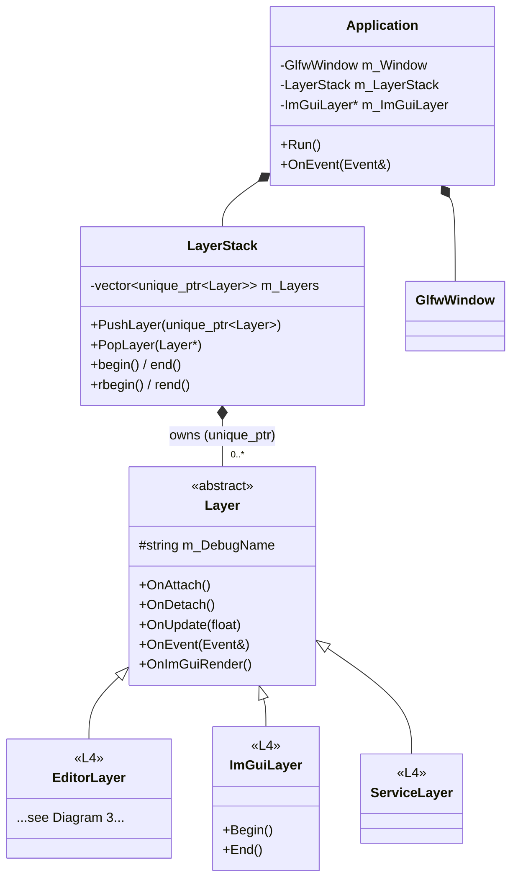

**Event flow:** `GlfwWindow callbacks → Application::OnEvent → LayerStack::rbegin()→rend()` (reverse, last-pushed first).
**Update flow:** `LayerStack::begin()→end()` (insertion order, EditorLayer first).

---

## Diagram 2 — Scene & ECS Systems (L3 Core)

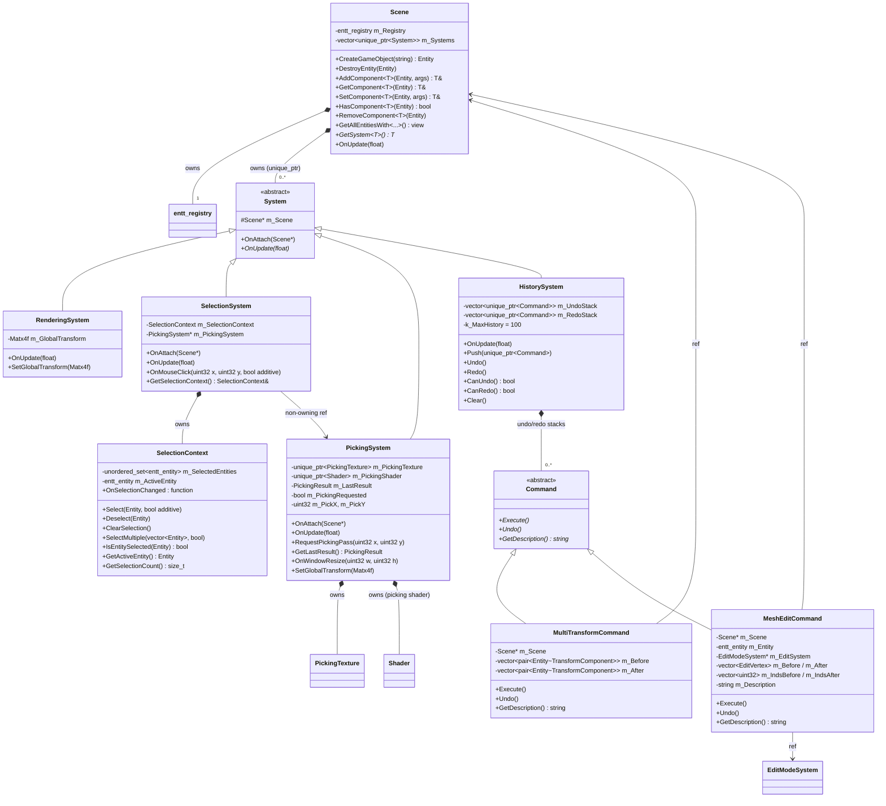

**Note:** `SelectionSystem` obtains `m_PickingSystem` via `scene->GetSystem<PickingSystem>()` in `OnAttach`. `HistorySystem` is also fetched at attach time by systems that push commands.

---

## Diagram 3 — Editor Layer & UI (L4)

```mermaid
classDiagram
direction TB

class EditorLayer {
    -unique_ptr~Scene~ m_ActiveScene
    -Camera m_EditorCamera
    -Entity m_CameraEntity
    -unique_ptr~EditorCameraController~ m_CameraController
    -unique_ptr~InfGrid~ m_Grid
    -unique_ptr~Framebuffer~ m_ViewportFBO
    -bool m_InEditMode
    -unique_ptr~EditModeSystem~ m_EditModeSystem
    -unique_ptr~GizmoRenderer~ m_GizmoRenderer
    -unique_ptr~EntityFactory~ m_EntityFactory
    -unique_ptr~ViewportPanel~ m_ViewportPanel
    -unique_ptr~OutlinerPanel~ m_OutlinerPanel
    -unique_ptr~InspectorPanel~ m_InspectorPanel
    -unique_ptr~MainMenuBar~ m_MainMenuBar
    -unique_ptr~ScenePanel~ m_ScenePanel
    +OnAttach()
    +OnUpdate(float)
    +OnImGuiRender()
    +OnEvent(Event&)
}

class Panel {
    <<abstract>>
    +bool IsVisible
    +OnImGuiRender()*
}

class ViewportPanel {
    -Framebuffer* m_Framebuffer
    -ResizeCallback m_OnResize
    -Vec2 m_ViewportMin
    +IsFocused() bool
    +IsHovered() bool
    +GetViewportMin() Vec2
}

class OutlinerPanel {
    -Scene* m_Scene
    -SelectionSystem* m_SelectionSystem
    +SetInEditMode(bool, string_view)
    +TriggerDeleteConfirmation()
}

class InspectorPanel {
    -Scene* m_Scene
    -SelectionContext* m_SelectionContext
    -HistorySystem* m_HistSys
    -GizmoRenderer* m_GizmoRenderer
    -EditModeSystem* m_EditModeSystem
    -Entity m_SnapshotEntity
    -TransformComponent m_TransformSnapshot
}

class ScenePanel {
    -Scene* m_Scene
    -Camera* m_Camera
}

class MainMenuBar {
    -Scene* m_Scene
    -EntityFactory* m_EntityFactory
    -EditorLayer* m_EditorLayer
}

class GizmoRenderer {
    -Scene& m_Scene
    -SelectionContext& m_SelCtx
    -Camera& m_Camera
    -HistorySystem* m_HistSys
    -GizmoMode m_Mode
    -GizmoSpace m_Space
    -PivotMode m_PivotMode
    -SnapConfig m_Snap
    -bool m_IsDragging
    -GizmoAxis m_DragAxis
    -vector~pair~Entity~TransformComponent~~ m_SnapshotTransforms
    +Draw()
    +OnMouseButtonPressed(float vx, float vy) bool
    +OnMouseButtonReleased() bool
    +OnMouseMoved(float vx, float vy) bool
    +SetMode(GizmoMode)
    +ToggleSpace()
    +SetPivotMode(PivotMode)
    +SetSnapConfig(SnapConfig)
}

class EditorCameraController {
    -Camera* m_CameraToControl
    -Vec2 m_LastMousePosition
    -float m_MovementSpeed
    -float m_MouseSensitivity
    +OnUpdate(float)
    +OnScrolled(float)
}

class EntityFactory {
    -Scene* m_Scene
    -shared_ptr~Shader~ m_DefaultShader
    +SpawnPrimitive(PrimitiveType)
    +SpawnFromFile(string) expected~void~string~
}

class GizmoMode {
    <<enumeration>>
    Translation
    Rotation
    Scale
}

class GizmoSpace {
    <<enumeration>>
    Global
    Local
}

class PivotMode {
    <<enumeration>>
    IndividualOrigins
    MedianPoint
    ActiveElement
}

Panel <|-- ViewportPanel
Panel <|-- OutlinerPanel
Panel <|-- InspectorPanel
Panel <|-- ScenePanel
Panel <|-- MainMenuBar
EditorLayer *-- Scene
EditorLayer *-- EditorCameraController
EditorLayer *-- InfGrid
EditorLayer *-- Framebuffer
EditorLayer *-- EditModeSystem
EditorLayer *-- GizmoRenderer
EditorLayer *-- EntityFactory
EditorLayer *-- ViewportPanel
EditorLayer *-- OutlinerPanel
EditorLayer *-- InspectorPanel
EditorLayer *-- MainMenuBar
EditorLayer *-- ScenePanel
EditorCameraController --> Camera : controls (ptr)
GizmoRenderer --> Scene : ref
GizmoRenderer --> SelectionContext : ref
GizmoRenderer --> Camera : ref
GizmoRenderer --> HistorySystem : ref (via Scene::GetSystem)
InspectorPanel --> Scene : ref
InspectorPanel --> SelectionContext : ref
InspectorPanel --> GizmoRenderer : ref
InspectorPanel --> EditModeSystem : ref
OutlinerPanel --> Scene : ref
OutlinerPanel --> SelectionSystem : ref
ViewportPanel --> Framebuffer : ref (non-owning)
EntityFactory --> Scene : ref
```

---

## Diagram 4 — Edit Mode (L3)

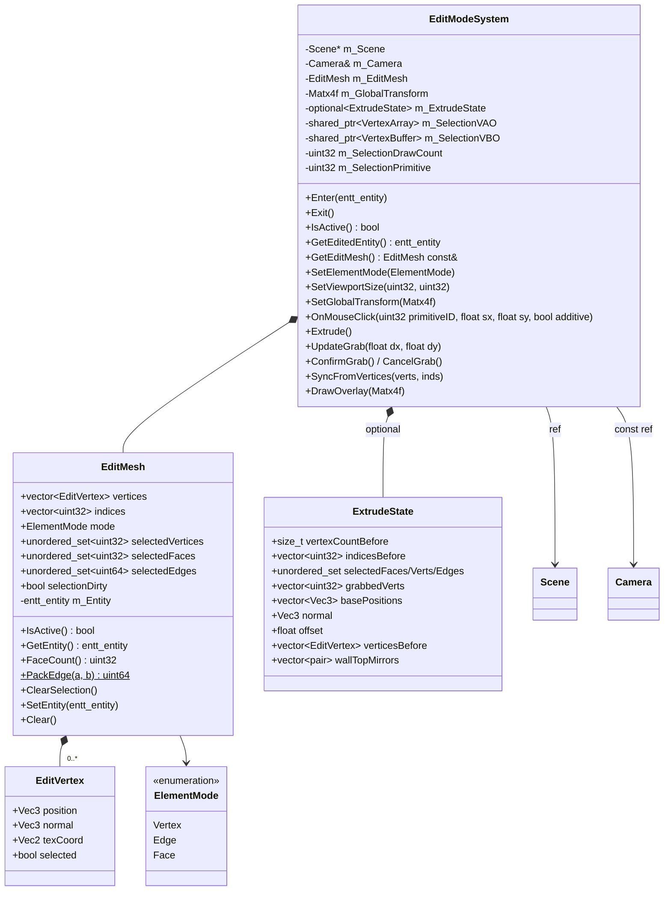

**Picking in edit mode:**
- Enter: `PickingSystem` renders `primitiveID` per triangle (encodes `gl_PrimitiveID`).
- Click: `EditModeSystem::OnMouseClick(primitiveID, sx, sy, additive)` resolves triangle → vertex/edge/face based on `m_EditMesh.mode`.
- Edge key: `PackEdge(a, b)` = `(min<<32) | max` — order-independent.

---

## Diagram 5 — Renderer & Assets (L3)

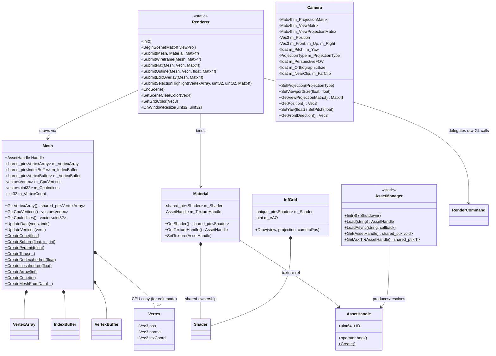

---

## Diagram 6 — Platform Graphics (L2)

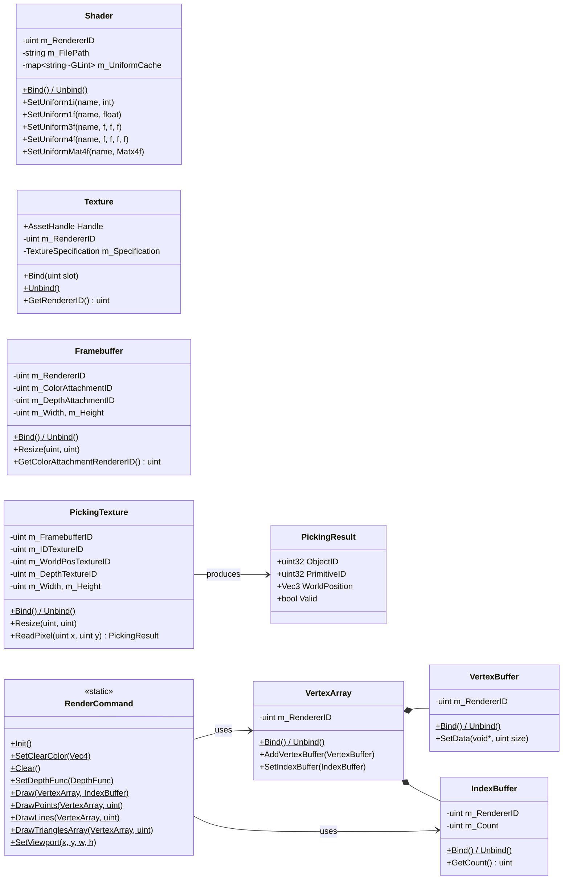

---

## ECS Component Map

All components live in `Core/Components/Component.hpp`. They are plain data — no methods (except `TransformComponent::GetMatrix`), no virtuals.

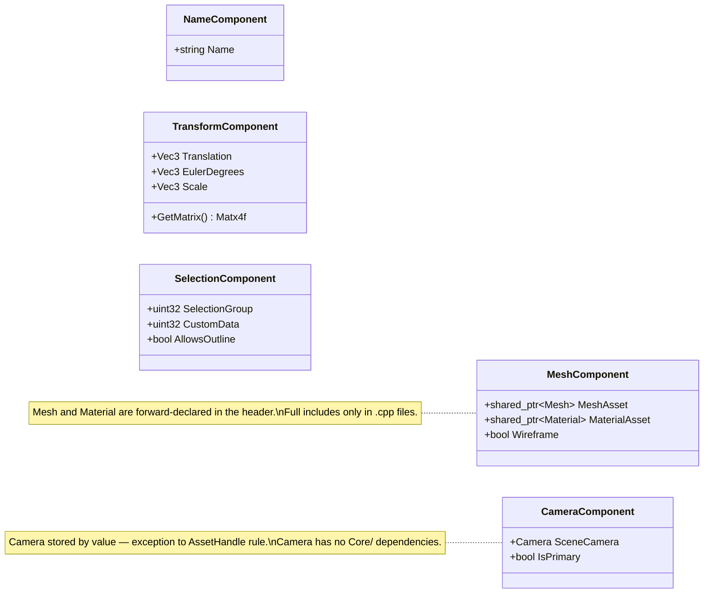

---

## Key Cross-System Pointer Map

Non-obvious references between systems and classes:

| Holder | Field | Target | How obtained |
|---|---|---|---|
| `SelectionSystem` | `m_PickingSystem` | `PickingSystem*` | `scene->GetSystem<PickingSystem>()` in `OnAttach` |
| `GizmoRenderer` | `m_HistSys` | `HistorySystem*` | `scene.GetSystem<HistorySystem>()` in `OnAttach` |
| `InspectorPanel` | `m_HistSys` | `HistorySystem*` | passed from `EditorLayer` after scene init |
| `InspectorPanel` | `m_EditModeSystem` | `EditModeSystem*` | `SetEditModeSystem()` called from `EditorLayer::OnAttach` |
| `MeshEditCommand` | `m_EditSystem` | `EditModeSystem*` | passed at command construction site |
| `EditorCameraController` | `m_CameraToControl` | `Camera*` | pointer to `EditorLayer::m_EditorCamera` |
| `OutlinerPanel` | `m_SelectionSystem` | `SelectionSystem*` | `scene->GetSystem<SelectionSystem>()` |
| `ViewportPanel` | `m_Framebuffer` | `Framebuffer*` | pointer to `EditorLayer::m_ViewportFBO` |

---

## Planned Extensions

Classes and relationships **not yet implemented**. Each block is a self-contained implementation unit. Refer to `doc/skills/planned-arch.md` for file locations and full specs.

### A — Lighting System
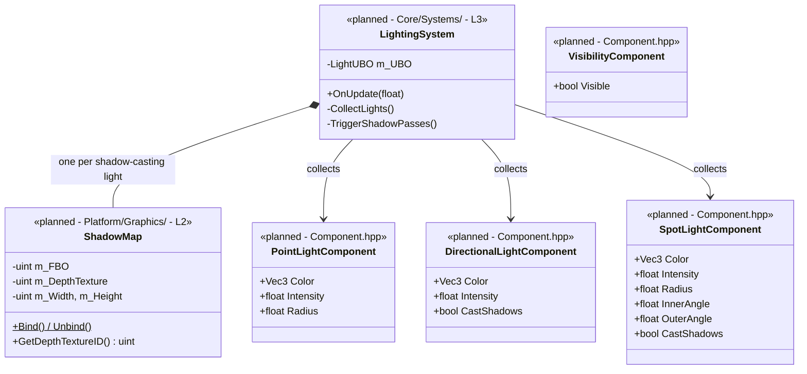

### B — Modifier Stack
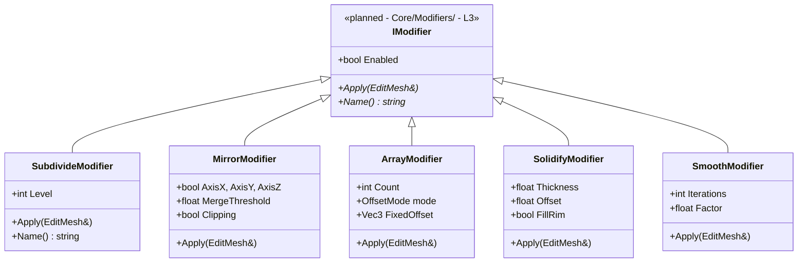
`MeshComponent` gains `vector<unique_ptr<IModifier>> Modifiers` + `bool ModifiersDirty`. `RenderingSystem` evaluates the stack when dirty and re-uploads — does not modify the base mesh.

### C — Post-Process Stack
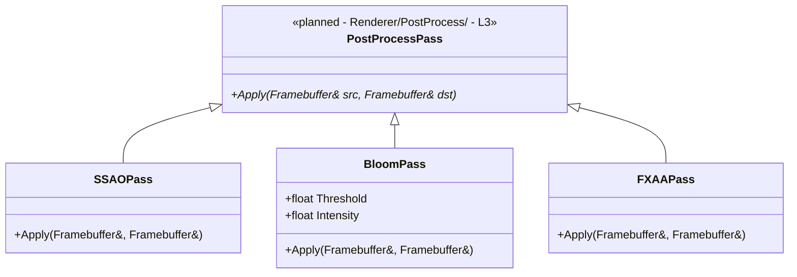
`EditorLayer` gains `vector<unique_ptr<PostProcessPass>> m_PostProcessPasses`. Evaluated after main render, before viewport FBO; ping-pongs two intermediate `Framebuffer` objects.

### D — Scene Serialization
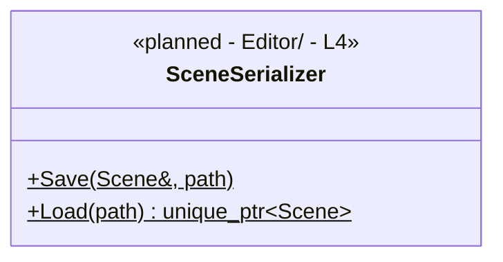
JSON format. Asset paths stored relative to project root. Re-loads via `AssetManager::Load()`. L4 because it knows the full component set.

### E — Preferences & Keymap
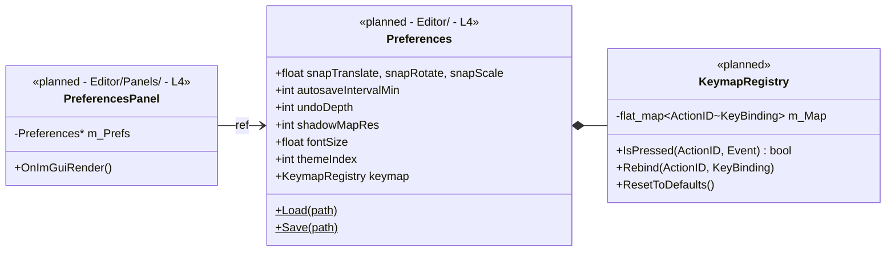

### F — Parent/Child Hierarchy
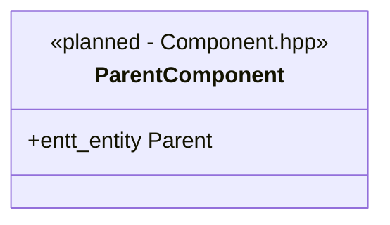
`TransformComponent` becomes local-space. `RenderingSystem` DFS-traverses entity graph each frame to compute world transforms. `Scene` gains `SetParent(child, parent)` / `ClearParent(child)`.

### G — PBR Material Expansion
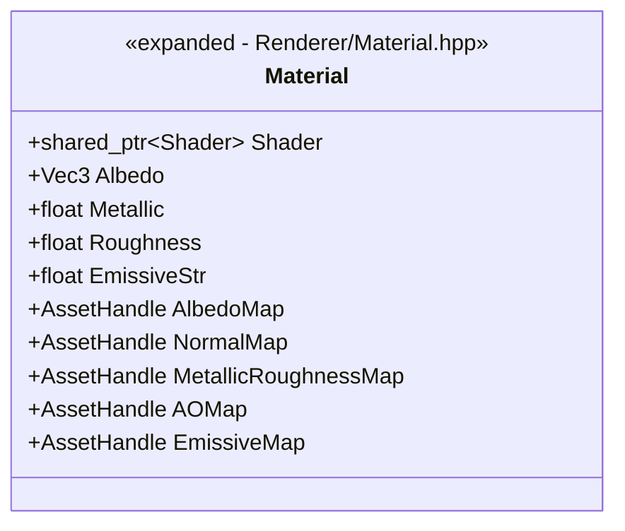
`MeshComponent::MaterialAsset` → `vector<shared_ptr<Material>>` (multiple material slots). `RenderingSystem` issues one draw call per slot.

---

## Full Ownership Tree (text)

```
Application
├── GlfwWindow
└── LayerStack
    ├── ImGuiLayer
    ├── ServiceLayer
    └── EditorLayer
        ├── Scene
        │   ├── entt::registry  (all entities + components)
        │   ├── RenderingSystem
        │   ├── SelectionSystem
        │   │   └── SelectionContext
        │   ├── PickingSystem
        │   │   ├── PickingTexture (FBO + 2 attachments)
        │   │   └── Shader (picking shader)
        │   └── HistorySystem
        │       ├── [undo stack] Command*
        │       └── [redo stack] Command*
        ├── Camera (EditorCamera — value, not owned via ptr)
        ├── EditorCameraController → Camera*
        ├── InfGrid
        │   └── Shader
        ├── Framebuffer (viewport FBO)
        ├── EditModeSystem → Scene*, Camera&
        │   ├── EditMesh
        │   │   └── vector<EditVertex>
        │   └── VertexArray/VertexBuffer (selection overlay)
        ├── GizmoRenderer → Scene&, SelectionContext&, Camera&, HistorySystem*
        │   └── Mesh (arrow, ring, cone, cube — gizmo shapes)
        ├── EntityFactory → Scene*
        │   └── Shader (default shader)
        ├── ViewportPanel → Framebuffer*
        ├── OutlinerPanel → Scene*, SelectionSystem*
        ├── InspectorPanel → Scene*, SelectionContext*, GizmoRenderer*, EditModeSystem*
        ├── ScenePanel
        └── MainMenuBar

Entities (in entt::registry):
└── [entity]
    ├── NameComponent
    ├── TransformComponent
    ├── MeshComponent → shared_ptr<Mesh>, shared_ptr<Material>
    ├── CameraComponent (Camera by value)
    └── SelectionComponent

Mesh
├── VertexArray
│   ├── VertexBuffer
│   └── IndexBuffer
└── vector<Vertex>  (CPU copy for edit mode)

Material
└── shared_ptr<Shader>
    (+ AssetHandle → Texture resolved at draw time via AssetManager)
```
